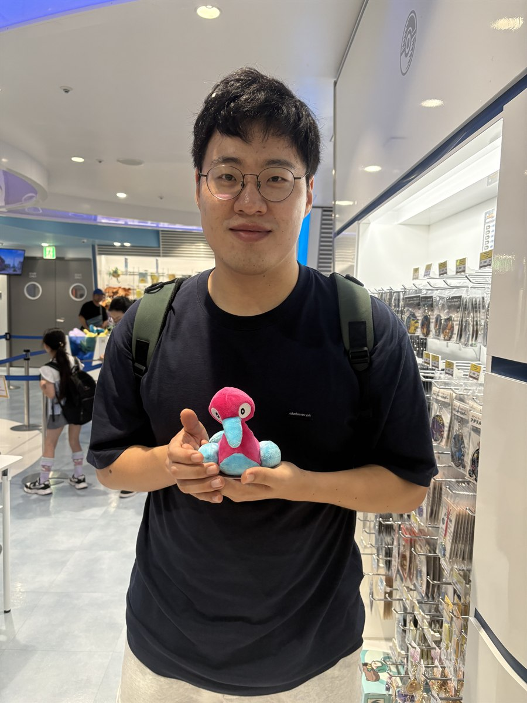

<!--
  홈 화면 레이아웃은 Quarto/Bootstrap 의 12칸 그리드입니다.
  · .g-col-12    → 좁은 화면(모바일)에서 12칸 = 전체 너비. 두 블록이 위아래로 쌓입니다.
  · .g-col-md-5  → 768px 이상(데스크톱)에서만 적용. 사진 5칸 + 글 7칸 = 두 단.
  숫자를 바꿔 좌우 비율을 조절하되 합이 12가 되게 하세요.
  사진 크기는 파일이 아니라 칼럼 폭이 정합니다 (styles.css 의 .profile-photo).
-->

::: {.grid}

::: {.g-col-12 .g-col-md-5}

{.profile-photo fig-alt="Dong-june Choi"}

**Email:** [choi.1702@osu.edu](mailto:choi.1702@osu.edu)\
**Office:** [Math building 412](https://maps.app.goo.gl/1D2iPoQm1fzhiReQA)

:::

::: {.g-col-12 .g-col-md-7}

Welcome! My name is Dong-june Choi and I am a graduate student at the
[Ohio State University](https://math.osu.edu/) math department. My academic advisor is
Prof. [Kenneth Koenig](https://math.osu.edu/people/koenig.271).
I study several complex variables and harmonic analysis.
I did my undergraduate work at [POSTECH](https://math.postech.ac.kr/en/).

:::

:::
